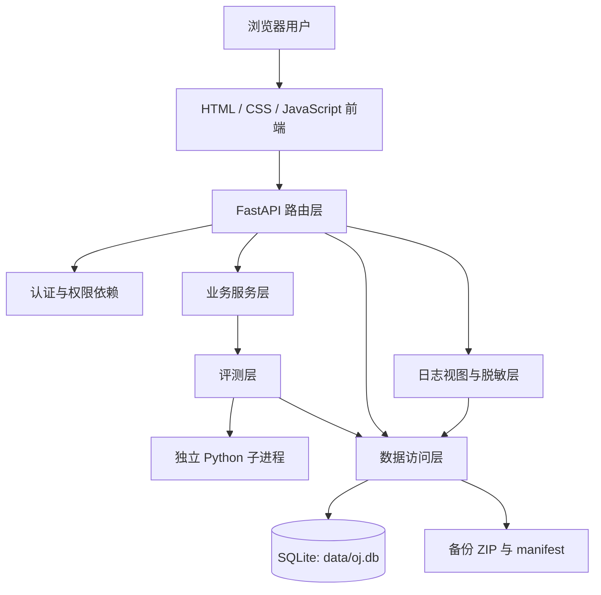
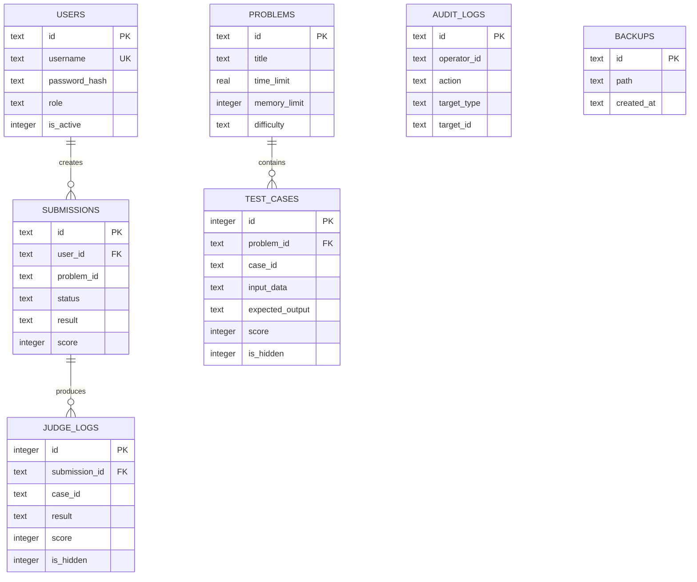

# Python 在线评测系统实验报告

**课程：** 程序设计训练  
**作业：** 第二次大作业  
**作者：** 蒋孝鹏  
**学号：** 2025080027  

---

## 1. 项目概述

### 1.1 项目目标

本项目实现一个面向 Python 程序设计教学的在线评测系统。系统支持学生注册、登录、浏览题目、提交 Python 代码并查看评测结果；教师可以管理题目、查看全部提交及完整评测日志并发起重新评测；管理员在教师权限基础上还可以管理用户、查询审计日志以及创建和恢复数据备份。

项目的主要目标如下：

1. 实现完整的题目增删改查和测试点管理。
2. 使用独立子进程安全运行学生提交的 Python 程序。
3. 支持 `AC`、`WA`、`RE`、`TLE` 和 `SE` 五种评测结果。
4. 支持学生、教师和管理员三种角色及后端权限校验。
5. 实现提交状态管理、异步评测、提交历史和重新评测。
6. 根据访问者角色提供不同粒度的评测日志，保护隐藏测试点。
7. 使用 SQLite 持久化用户、题目、提交、日志和备份记录。
8. 支持管理员创建备份、校验备份和恢复数据库。
9. 提供 Web 前端完成主要操作。
10. 使用 pytest 对核心功能进行自动化测试。

### 1.2 已完成功能

#### 题目管理

- 查询题目列表和题目详情。
- 教师及管理员创建题目。
- 教师及管理员修改题目。
- 教师及管理员删除题目。
- 保存题目描述、输入说明、输出说明、数据范围、样例、难度、标签、时间限制和内存限制。
- 为每道题配置公开测试点和隐藏测试点。
- 校验题目编号唯一性、测试点编号唯一性及测试点分值。

#### Python 自动评测

- 将学生源代码写入独立临时目录中的 `main.py`。
- 使用 `subprocess.run()` 启动独立 Python 子进程。
- 不使用 `eval()` 或 `exec()` 执行学生代码。
- 使用超时参数限制运行时间。
- 捕获标准输出、标准错误和退出码。
- 支持 `AC`、`WA`、`RE`、`TLE` 和 `SE`。
- 评测完成后自动清理临时目录。
- 限制继承的环境变量，避免学生程序读取 Web 服务端环境信息。
- 对非 UTF-8 输出进行处理。
- 对错误信息进行路径脱敏和长度截断。

#### 用户与权限

- 用户注册、登录、退出和当前用户查询。
- 密码哈希存储，不保存明文密码。
- 三种角色：`student`、`teacher`、`admin`。
- 支持停用和启用用户。
- 学生只能查看自己的提交和安全裁剪后的日志。
- 教师可以管理题目、查看全部提交和完整日志并重新评测。
- 管理员可以管理用户、审计日志和备份恢复。
- 权限在后端路由中校验，而不是仅依赖前端隐藏按钮。
- 用户接口不返回密码和密码哈希。

#### 提交与状态管理

- 创建提交后返回 `202 Accepted`。
- 提交状态包括 `pending`、`running`、`finished` 和 `failed`。
- 正常评测流程为 `pending → running → finished`。
- 系统评测错误流程为 `pending/running → failed`，结果为 `SE`。
- SQLite 触发器校验状态和结果组合。
- 支持提交列表分页和条件筛选。
- 学生只能查询自己的提交。
- 教师和管理员可以查询全部提交。
- 教师和管理员可以重新评测已完成或失败的提交。

#### 评测日志与审计日志

- 每个测试点保存独立评测日志。
- 保存测试点编号、结果、得分、耗时、退出码、输入、标准输出、标准错误、期望输出、提示信息和隐藏标记。
- 学生视图删除隐藏测试点的输入、期望输出和完整实际输出。
- 教师与管理员视图提供完整但经过脱敏和截断的日志。
- Linux 和 Windows 绝对路径均进行脱敏。
- 超长输出进行截断。
- 教师或管理员查看完整评测日志时写入审计日志。
- 管理员可以按照操作者、动作、目标和时间范围筛选审计日志。

#### 数据持久化、备份与恢复

- 使用 SQLite 文件 `data/oj.db` 作为主要数据源。
- 用户、题目、测试点、提交、评测日志、审计日志和备份记录均持久化。
- 服务重启后数据仍然存在。
- 备份采用 SQLite 在线备份接口生成一致性数据库副本。
- 备份 ZIP 包含 `oj.db` 和 `manifest.json`。
- `manifest.json` 记录备份编号、创建时间、存储类型、格式版本、文件列表和 SHA-256 校验值。
- 恢复前检查 ZIP 结构、manifest、备份编号、存储类型、格式版本、校验和、SQLite 完整性及必要数据表。
- 恢复时保存当前数据库的回滚副本。
- 恢复失败时保留原数据库，不破坏当前数据。
- 恢复成功后清除当前登录会话，避免恢复后的用户状态与旧会话不一致。

#### 前端

- 中文登录和注册界面。
- 题目列表和题目详情。
- 在线代码输入和提交。
- 提交记录、状态和结果查询。
- 教师和管理员题目创建、修改、删除界面。
- 用户管理界面。
- 审计日志界面。
- 备份与恢复界面。
- 根据当前用户角色显示相应操作。
- 前端通过 Fetch API 调用后端接口。
- 使用 Session Cookie 保持登录状态。

### 1.3 未完成功能

本项目完成了作业基础模块。未实现以下进阶功能：

- 代码相似度检测。
- 自定义评测器 SPJ。
- 严格输出比较模式。
- 多语言评测。
- 容器级沙箱和操作系统级资源隔离。

这些功能属于进阶扩展，不影响基础模块的完整运行。当前系统只允许提交 Python 代码，适合本次课程作业和本地验收环境。

### 1.4 持久化方式

项目选择 **SQLite** 作为持久化方式。数据库默认路径为：

```text
data/oj.db
```

选择 SQLite 的原因是：

- 不需要单独安装数据库服务器；
- 支持事务、约束、索引和外键；
- 适合课程作业规模；
- 便于本地运行、迁移、备份和恢复；
- 可以通过 SQLite 在线备份接口获得一致性快照。

### 1.5 进阶模块完成情况

本项目未申报进阶模块加分，重点保证基础模块、权限安全、日志保护、数据持久化及备份恢复的完整性和稳定性。

---

## 2. 系统架构

### 2.1 总体架构

系统采用分层结构，将 HTTP 路由、业务逻辑、数据访问、评测执行、日志处理和前端展示分离。



### 2.2 路由层

路由层位于 `app/routers/`，负责：

- 接收和校验 HTTP 请求；
- 调用认证和角色依赖；
- 调用数据访问函数或业务服务；
- 将结果封装为统一响应；
- 将业务异常转换为对应 HTTP 状态码。

主要路由文件包括：

| 文件 | 职责 |
|---|---|
| `auth.py` | 注册、登录、退出和当前用户 |
| `problems.py` | 题目增删改查 |
| `submissions.py` | 创建提交、列表、详情和重新评测 |
| `logs.py` | 单次提交日志及全局日志查询 |
| `users.py` | 管理员用户管理 |
| `audit_logs.py` | 管理员审计日志查询 |
| `backups.py` | 备份创建、列表和恢复 |

所有主要接口均使用 `async def` 声明。耗时的学生程序评测不在请求处理函数中直接执行，而是交由后台任务处理。

### 2.3 业务层

业务层位于 `app/services/`。

`judge_service.py` 负责完整评测流程：

1. 获取提交记录；
2. 将状态从 `pending` 更新为 `running`；
3. 加载题目和测试点；
4. 调用评测器逐个执行测试点；
5. 保存测试点日志；
6. 根据最终结果将提交标记为 `finished` 或 `failed`；
7. 写入系统审计事件；
8. 捕获系统异常并生成 `SE` 日志。

`startup.py` 负责项目启动时初始化管理员账号。

### 2.4 数据访问层

数据访问层位于 `app/repositories/`，直接操作 SQLite：

- `database.py`：建立连接、创建表、索引和触发器；
- `users.py`：用户查询和修改；
- `problems.py`：题目及测试点持久化；
- `submissions.py`：提交、状态和评测日志；
- `audit_logs.py`：审计日志；
- `backups.py`：备份记录、备份文件和恢复。

数据访问层统一使用参数化 SQL，避免将用户输入直接拼接到 SQL 字符串中。

### 2.5 评测层

评测层位于 `app/judge/`：

| 文件 | 职责 |
|---|---|
| `runner.py` | 创建临时目录并运行学生 Python 程序 |
| `comparator.py` | 比较实际输出和期望输出 |
| `evaluator.py` | 判定单测试点和整次提交结果 |

评测器与 Web 路由解耦，因此可以单独进行自动化测试。

### 2.6 日志层

日志相关功能主要位于：

- `app/utils/logs.py`
- `app/utils/log_views.py`
- `app/repositories/audit_logs.py`
- `app/routers/logs.py`

日志层完成：

- 错误信息路径脱敏；
- 标准输出和错误输出截断；
- 学生视图和教师视图区分；
- 隐藏测试点字段裁剪；
- 完整日志访问审计；
- 日志分页和筛选。

### 2.7 前端层

前端使用原生 HTML、CSS 和 JavaScript，文件位于：

```text
app/templates/index.html
app/static/css/
app/static/js/
```

FastAPI 将 `/static` 挂载为静态资源路径，并通过根路由返回主页面。前端模块按功能拆分为：

- `api.js`：统一请求和错误处理；
- `app.js`：应用初始化、导航及登录状态；
- `problems.js`：题目列表、详情和管理；
- `submissions.js`：代码提交、记录和日志；
- `users.js`：用户管理；
- `audit.js`：审计日志；
- `backups.js`：备份恢复；
- `utils.js`：通用前端工具。

---

## 3. 数据设计

### 3.1 用户表 `users`

| 字段 | 含义 |
|---|---|
| `id` | 用户唯一编号 |
| `username` | 唯一用户名 |
| `password_hash` | 密码哈希 |
| `role` | `student`、`teacher` 或 `admin` |
| `is_active` | 是否启用 |
| `created_at` | 创建时间 |
| `updated_at` | 更新时间 |

设计要点：

- `username` 使用唯一约束；
- 密码只保存哈希；
- 角色使用 `CHECK` 约束；
- 停用用户不能登录或继续访问受保护接口。

### 3.2 题目表 `problems`

| 字段 | 含义 |
|---|---|
| `id` | 题目编号 |
| `title` | 标题 |
| `description` | 题目描述 |
| `input_description` | 输入说明 |
| `output_description` | 输出说明 |
| `samples` | JSON 格式样例 |
| `constraints_text` | 数据范围 |
| `time_limit` | 时间限制 |
| `memory_limit` | 内存限制 |
| `difficulty` | `easy`、`medium` 或 `hard` |
| `tags` | JSON 格式标签 |
| `created_at` | 创建时间 |
| `updated_at` | 更新时间 |

### 3.3 测试点表 `test_cases`

| 字段 | 含义 |
|---|---|
| `id` | 数据库内部编号 |
| `problem_id` | 所属题目 |
| `case_id` | 题目内测试点编号 |
| `input_data` | 测试输入 |
| `expected_output` | 期望输出 |
| `score` | 测试点分值 |
| `is_hidden` | 是否隐藏 |

设计要点：

- `problem_id` 外键关联 `problems`；
- 删除题目时级联删除测试点；
- `(problem_id, case_id)` 唯一；
- 隐藏测试点数据不得返回给学生。

### 3.4 提交表 `submissions`

| 字段 | 含义 |
|---|---|
| `id` | 提交唯一编号 |
| `user_id` | 提交用户 |
| `problem_id` | 题目编号 |
| `language` | 当前固定为 `python` |
| `source_code` | 学生源代码 |
| `status` | `pending`、`running`、`finished`、`failed` |
| `result` | `AC`、`WA`、`RE`、`TLE`、`SE` 或空 |
| `score` | 总分 |
| `total_time` | 总运行时间 |
| `created_at` | 创建时间 |
| `started_at` | 开始评测时间 |
| `finished_at` | 完成时间 |

提交表不对 `problem_id` 设置级联外键，目的是删除题目后仍保留历史提交。

数据库触发器约束合法组合：

- `pending/running` 时 `result` 必须为空；
- `finished` 时 `result` 必须为 `AC/WA/RE/TLE`；
- `failed` 时 `result` 必须为 `SE`。

### 3.5 评测日志表 `judge_logs`

| 字段 | 含义 |
|---|---|
| `submission_id` | 所属提交 |
| `case_id` | 测试点编号 |
| `result` | 测试点结果 |
| `score` | 测试点得分 |
| `time_used` | 耗时 |
| `memory_used` | 内存字段 |
| `exit_code` | 子进程退出码 |
| `input_data` | 测试输入 |
| `stdout` | 实际标准输出 |
| `stderr` | 标准错误 |
| `expected_output` | 期望输出 |
| `message` | 评测提示 |
| `is_hidden` | 是否隐藏 |
| `created_at` | 创建时间 |

`(submission_id, case_id)` 唯一，重新评测时更新该提交对应的日志集合。

### 3.6 审计日志表 `audit_logs`

| 字段 | 含义 |
|---|---|
| `id` | 日志编号 |
| `operator_id` | 操作者编号，系统任务使用 `system` |
| `action` | 操作类型 |
| `target_type` | 目标类型 |
| `target_id` | 目标编号 |
| `success` | 是否成功 |
| `detail` | JSON 格式详情 |
| `created_at` | 操作时间 |

典型操作包括：

- `CREATE_PROBLEM`
- `UPDATE_PROBLEM`
- `DELETE_PROBLEM`
- `UPDATE_USER_ROLE`
- `DISABLE_USER`
- `ENABLE_USER`
- `REJUDGE_SUBMISSION`
- `VIEW_FULL_JUDGE_LOG`
- `CREATE_BACKUP`
- `RESTORE_BACKUP`
- `JUDGING_STARTED`
- `JUDGING_FINISHED`
- `JUDGING_FAILED`

### 3.7 备份记录表 `backups`

| 字段 | 含义 |
|---|---|
| `id` | 备份编号 |
| `path` | ZIP 文件路径 |
| `created_at` | 创建时间 |

备份文件与数据库中的备份记录共同用于查询和恢复。

### 3.8 数据关系



---

## 4. 核心实现

### 4.1 异步启动评测

学生调用 `POST /api/submissions` 后，后端首先：

1. 校验用户已登录；
2. 校验题目存在；
3. 校验语言为 Python；
4. 校验源代码长度；
5. 创建状态为 `pending` 的提交；
6. 将 `process_submission(submission_id)` 加入 FastAPI 后台任务；
7. 立即返回 HTTP `202`。

因此 HTTP 请求不需要等待学生代码执行完成。前端随后轮询提交详情，显示状态从 `pending` 到 `running`，最后到 `finished` 或 `failed`。

### 4.2 运行和终止学生代码

评测运行器采用以下流程：

1. 在 `temp/` 下创建随机临时目录；
2. 将源代码按 UTF-8 写入 `main.py`；
3. 使用当前 Python 解释器的绝对路径启动：
   ```text
   python -I main.py
   ```
4. 通过标准输入传入测试数据；
5. 使用管道捕获标准输出和标准错误；
6. 设置 `timeout=time_limit`；
7. 将工作目录设置为该提交的临时目录；
8. 仅传入最小安全环境变量；
9. 运行结束或发生异常后退出 `TemporaryDirectory`，自动删除临时文件。

`-I` 启用 Python 隔离模式，减少学生代码对当前工作环境和用户包的依赖。学生程序不在 FastAPI 主进程中运行。

当超过时间限制时，`subprocess.TimeoutExpired` 被捕获，当前测试点判定为 `TLE`。评测器不会无限等待学生程序。

### 4.3 AC、WA、RE、TLE 和 SE 判定

单测试点判定顺序如下：

1. 运行器自身异常：`SE`；
2. 子进程超时：`TLE`；
3. 输出无法按 UTF-8 解码：`RE`；
4. 子进程退出码非零：`RE`；
5. 实际输出与期望输出匹配：`AC`；
6. 其他情况：`WA`。

整次提交结果规则：

- 所有已运行测试点均为 `AC`：最终结果为 `AC`；
- 存在 `SE`：最终结果为 `SE`；
- 否则存在 `TLE`：最终结果为 `TLE`；
- 否则存在 `RE`：最终结果为 `RE`；
- 其他不全为 AC 的情况：最终结果为 `WA`。

每个通过的测试点获得其设置分值，未通过的测试点得 0 分。发生 `RE`、`TLE` 或 `SE` 后停止继续执行后续测试点，避免无意义运行和资源消耗。

### 4.4 输出比较

输出比较由 `app/judge/comparator.py` 完成。比较前对输出进行统一标准化，以处理常见行尾差异，再比较实际输出和期望输出。

基础模式使用统一的标准比较规则，不启用严格模式或 SPJ。若结果一致则为 `AC`，否则为 `WA`。

### 4.5 提交状态管理

创建提交时：

```text
status = pending
result = null
```

后台任务开始后使用条件更新：

```text
pending → running
```

普通评测结束：

```text
running → finished
result ∈ {AC, WA, RE, TLE}
```

评测系统错误：

```text
pending/running → failed
result = SE
```

状态更新函数检查当前状态，避免多个任务对同一提交进行非法重复更新。数据库触发器再次检查状态与结果组合，形成业务层和数据库层双重保护。

重新评测时，教师或管理员将已结束的提交重置为 `pending`，清理旧的结束时间和结果，再启动新的后台评测。

### 4.6 权限校验

权限通过 FastAPI 依赖在后端统一执行：

- `get_current_user`：要求已登录且账号启用；
- `require_teacher`：要求角色为 `teacher` 或 `admin`；
- `require_admin`：要求角色为 `admin`。

典型规则：

| 操作 | student | teacher | admin |
|---|---:|---:|---:|
| 浏览题目 | ✓ | ✓ | ✓ |
| 提交代码 | ✓ | ✓ | ✓ |
| 查看自己的提交 | ✓ | ✓ | ✓ |
| 查看全部提交 | ✗ | ✓ | ✓ |
| 管理题目 | ✗ | ✓ | ✓ |
| 查看完整日志 | ✗ | ✓ | ✓ |
| 重新评测 | ✗ | ✓ | ✓ |
| 管理用户 | ✗ | ✗ | ✓ |
| 查询审计日志 | ✗ | ✗ | ✓ |
| 备份与恢复 | ✗ | ✗ | ✓ |

学生访问他人提交或日志时返回 `403`。未登录访问受保护接口返回 `401`。仅隐藏前端按钮不能绕过后端权限。

### 4.7 隐藏测试点处理

系统根据用户角色生成两种日志视图。

#### 学生视图

始终提供：

- 测试点编号；
- 结果；
- 得分；
- 耗时；
- 安全处理后的信息；
- 安全处理后的标准错误。

对于非隐藏测试点，还可以返回：

- 实际输出；
- 期望输出。

对于隐藏测试点，不返回：

- `input_data`；
- `expected_output`；
- 完整 `stdout`；
- 退出码等内部细节。

#### 教师和管理员视图

教师和管理员可以查看：

- 输入；
- 实际输出；
- 标准错误；
- 期望输出；
- 退出码；
- 隐藏标记；
- 其他测试点字段。

但返回前仍进行路径脱敏和长度截断。每次查看完整日志都会写入 `VIEW_FULL_JUDGE_LOG` 审计记录。

### 4.8 日志脱敏和截断

系统使用日志工具函数完成：

- 将 Linux 绝对路径替换为安全路径；
- 将 Windows 绝对路径替换为安全路径；
- 将真实临时提交目录替换为类似 `<submission>/main.py` 的表示；
- 限制单字段最大长度；
- 对学生标准错误进一步裁剪；
- 避免向学生泄露服务器目录结构、测试答案和过长输出。

默认日志最大长度由配置项 `MAX_LOG_LENGTH` 控制，当前为 4000 字符。

### 4.9 数据持久化

应用启动时执行 `initialize_database()`：

- 创建缺失表；
- 开启外键；
- 使用 WAL 日志模式；
- 设置忙等待时间；
- 创建必要索引；
- 创建提交状态触发器；
- 执行兼容性迁移。

每次业务操作直接写入 SQLite，不以内存字典作为唯一数据源。因此服务重启后仍能恢复用户、题目、提交、日志和备份记录。

### 4.10 备份和恢复

#### 创建备份

管理员调用 `POST /api/admin/backups` 后：

1. 生成唯一备份编号；
2. 先写入备份记录；
3. 使用 `sqlite3.Connection.backup()` 创建一致性数据库副本；
4. 计算数据库文件 SHA-256；
5. 创建 `manifest.json`；
6. 将 `oj.db` 和 `manifest.json` 压缩为 ZIP；
7. 写入 `CREATE_BACKUP` 审计日志；
8. 返回备份编号和创建时间。

manifest 示例结构：

```json
{
  "backup_id": "备份编号",
  "created_at": "UTC 时间",
  "storage_type": "sqlite",
  "format_version": 1,
  "files": [
    {
      "name": "oj.db",
      "sha256": "文件校验值"
    }
  ]
}
```

#### 恢复备份

恢复前依次检查：

1. 数据库中存在备份记录；
2. ZIP 文件存在；
3. ZIP 只能包含 `manifest.json` 和 `oj.db`；
4. manifest 可按 UTF-8 和 JSON 解析；
5. manifest 中备份编号匹配；
6. 存储类型为 `sqlite`；
7. 格式版本受支持；
8. 文件列表正确；
9. SHA-256 与数据库文件一致；
10. `PRAGMA integrity_check` 返回 `ok`；
11. 必要数据表全部存在。

恢复时先生成当前数据库的回滚副本，再以原子替换方式更新正式数据库。若替换或校验失败，则使用回滚副本恢复原数据库。恢复成功后清除当前 Session，要求用户重新登录。

### 4.11 前端登录状态、接口调用和结果展示

前端通过 `GET /api/auth/me` 判断当前登录状态，并根据用户角色渲染导航和操作按钮。所有请求统一通过 `api.js` 发出，携带同源 Session Cookie。

代码提交后，前端：

1. 调用 `POST /api/submissions`；
2. 获得提交编号；
3. 定期调用 `GET /api/submissions/{submission_id}`；
4. 显示 `pending`、`running`、`finished` 或 `failed`；
5. 完成后显示结果、分数和日志；
6. 将结果显示为例如 `AC（答案正确）`，但后端枚举仍保持 `AC`。

题目管理、用户管理、审计日志和备份恢复页面同样通过后端 API 操作真实 SQLite 数据，不使用静态假数据代替后端功能。

---

## 5. API 说明

### 5.1 统一响应格式

成功响应采用：

```json
{
  "code": 200,
  "message": "success",
  "data": {}
}
```

常见错误状态码：

| 状态码 | 含义 |
|---:|---|
| `400` | 请求数据或状态不合法 |
| `401` | 未登录或登录凭据错误 |
| `403` | 账号停用或权限不足 |
| `404` | 资源不存在 |
| `409` | 用户名、题目编号冲突或非法状态冲突 |
| `422` | Pydantic 参数校验失败 |
| `500` | 未处理的服务器内部错误 |

### 5.2 认证接口

| 方法 | 路径 | 权限 | 主要请求参数 | 响应 | 常见错误 |
|---|---|---|---|---|---|
| POST | `/api/auth/register` | 公开 | `username`, `password` | 新用户，不含密码哈希 | 409、422 |
| POST | `/api/auth/login` | 公开 | `username`, `password` | 用户信息并建立 Session | 401、403 |
| POST | `/api/auth/logout` | 公开 | 无 | 清除 Session | — |
| GET | `/api/auth/me` | 已登录 | 无 | 当前用户 | 401、403 |

### 5.3 用户接口

| 方法 | 路径 | 权限 | 参数 | 响应 | 常见错误 |
|---|---|---|---|---|---|
| GET | `/api/users` | admin | 分页参数 | 用户列表，不含密码哈希 | 401、403 |
| POST | `/api/users` | admin | 用户名、密码、角色、状态 | 新建用户 | 409、422 |
| GET | `/api/users/{user_id}` | admin | 路径参数 | 用户详情 | 404 |
| PUT | `/api/users/{user_id}` | admin | 角色、状态等 | 修改后的用户 | 400、403、404、409 |

### 5.4 题目接口

| 方法 | 路径 | 权限 | 参数 | 响应 | 常见错误 |
|---|---|---|---|---|---|
| GET | `/api/problems` | 已登录 | 分页或筛选参数 | 题目列表 | 401 |
| GET | `/api/problems/{problem_id}` | 已登录 | 题目编号 | 题目详情；学生不含隐藏测试点 | 404 |
| POST | `/api/problems` | teacher/admin | 完整题目及测试点 | 新题目 | 400、409、422 |
| PUT | `/api/problems/{problem_id}` | teacher/admin | 完整题目及测试点 | 修改后的题目 | 400、404、409、422 |
| DELETE | `/api/problems/{problem_id}` | teacher/admin | 题目编号 | 删除结果 | 404 |

### 5.5 提交接口

| 方法 | 路径 | 权限 | 参数 | 响应 | 常见错误 |
|---|---|---|---|---|---|
| POST | `/api/submissions` | 已登录 | `problem_id`, `language`, `source_code` | 202，提交编号和初始状态 | 400、404、422 |
| GET | `/api/submissions` | 已登录 | 分页、题目、用户、结果、状态等 | 分页提交列表 | 403、422 |
| GET | `/api/submissions/{submission_id}` | 所有者或 teacher/admin | 提交编号 | 提交详情 | 403、404 |
| POST | `/api/submissions/{submission_id}/rejudge` | teacher/admin | 提交编号 | 202，重新进入等待状态 | 404、409 |

### 5.6 日志接口

| 方法 | 路径 | 权限 | 参数 | 响应 | 常见错误 |
|---|---|---|---|---|---|
| GET | `/api/submissions/{submission_id}/logs` | 所有者或 teacher/admin | 提交编号 | 按角色裁剪的日志 | 403、404 |
| GET | `/api/logs` | teacher/admin | 分页、提交、题目、用户、结果、时间 | 完整日志列表 | 403、422 |
| GET | `/api/audit-logs` | admin | 操作者、动作、目标、时间、分页 | 审计日志列表 | 403、422 |

### 5.7 备份接口

| 方法 | 路径 | 权限 | 参数 | 响应 | 常见错误 |
|---|---|---|---|---|---|
| POST | `/api/admin/backups` | admin | 无 | 201，备份编号和时间 | 403、500 |
| GET | `/api/admin/backups` | admin | 无 | 备份列表 | 403 |
| POST | `/api/admin/backups/{backup_id}/restore` | admin | 备份编号 | 恢复结果并清除 Session | 400、403、404、500 |

---

## 6. 测试结果

### 6.1 自动化测试方法

在项目根目录运行以下命令：

```bash
python -m pytest -v
````

该命令会自动发现并运行 `tests/` 目录中的全部 pytest 测试，并显示每个测试的执行结果。

本项目最终验收版本的自动化测试结果为：

```
15 passed, 1 warning in 6.75s
```

全部 15 个自动化测试均成功通过。测试过程中出现 1 条警告，但未导致任何测试失败。

### 6.2 AC、WA、RE 和 TLE

使用题目“P1001 A+B 问题”进行手工测试。

#### AC

```python
a, b = map(int, input().split())
print(a + b)
```

预期：

- 所有测试点通过；
- 状态为 `finished`；
- 结果为 `AC`；
- 得分为 100。

#### WA

```python
a, b = map(int, input().split())
print(a - b)
```

预期：

- 至少一个测试点输出不一致；
- 状态为 `finished`；
- 结果为 `WA`。

#### RE

```python
a, b = map(int, input().split())
print(undefined_variable)
```

预期：

- 子进程非零退出；
- 状态为 `finished`；
- 结果为 `RE`；
- 学生看不到完整服务器路径。

#### TLE

```python
while True:
    pass
```

预期：

- 超过题目时间限制；
- 子进程被终止；
- 状态为 `finished`；
- 结果为 `TLE`。

### 6.3 权限测试

| 测试 | 预期结果 |
|---|---|
| 未登录查询当前用户 | 401 |
| 重复用户名注册 | 409 |
| 错误密码登录 | 401 |
| 停用用户登录 | 403 |
| 学生调用题目创建接口 | 403 |
| 学生调用用户管理接口 | 403 |
| 教师调用管理员备份接口 | 403 |
| 学生查看他人提交 | 403 |
| 学生查看他人日志 | 403 |
| 管理员修改用户角色 | 成功 |
| 管理员停用用户后该用户再次访问 | 403 |
| 用户列表响应 | 不含密码和密码哈希 |

### 6.4 隐藏测试点测试

| 角色 | 隐藏输入 | 标准答案 | 完整输出 | 完整错误 |
|---|---:|---:|---:|---:|
| student | 不可见 | 不可见 | 不可见 | 不可见 |
| teacher | 可见 | 可见 | 可见 | 可见但已脱敏/截断 |
| admin | 可见 | 可见 | 可见 | 可见但已脱敏/截断 |

教师或管理员查看完整日志后，审计日志中应出现 `VIEW_FULL_JUDGE_LOG`。

### 6.5 状态流转测试

合法流转：

```text
pending → running → finished
pending → running → failed
finished/failed → pending（重新评测）
```

非法状态和结果组合应被业务逻辑或 SQLite 触发器拒绝。例如：

- `pending + AC`
- `running + WA`
- `finished + SE`
- `failed + AC`

### 6.6 日志脱敏和截断测试

测试内容包括：

- Linux 路径：`/tmp/.../main.py`
- Windows 路径：`C:\...\main.py`
- 超过最大长度的标准输出；
- 超过最大长度的标准错误；
- RE traceback；
- 隐藏测试点字段。

预期结果：

- 返回内容不包含真实绝对路径；
- 超长内容被截断；
- 学生无法获得隐藏输入和标准答案；
- 教师/管理员可获得完整业务字段；
- 完整日志访问产生审计记录。

### 6.7 重启持久化测试

步骤：

1. 创建用户、题目和提交；
2. 停止 Uvicorn；
3. 使用相同命令重新启动；
4. 再次登录并查询上述数据。

预期：

- 用户仍存在；
- 题目和测试点仍存在；
- 提交和评测日志仍存在；
- 审计日志仍存在；
- 备份记录仍存在。

### 6.8 备份恢复测试

#### 正常备份与恢复

1. 将 `student_demo` 设置为 `student` 且启用；
2. 创建备份；
3. 将其修改为 `teacher` 且停用；
4. 恢复备份；
5. 重新登录；
6. 验证恢复为 `student` 且启用。

预期：

- ZIP 含 `oj.db` 和 `manifest.json`；
- 恢复成功；
- 数据回到备份时状态；
- Session 被清除；
- 审计日志记录备份与恢复操作。

#### 损坏备份

测试以下情况：

- 不是有效 ZIP；
- 缺少 `manifest.json`；
- 缺少 `oj.db`；
- 包含额外文件；
- 备份编号不匹配；
- 格式版本不支持；
- SHA-256 不匹配；
- SQLite 完整性检查失败；
- 缺少必要数据表。

预期：

- 恢复失败并返回错误；
- 当前数据库仍然可用；
- 恢复前的数据不丢失。

### 6.9 前端完整流程测试

#### 学生流程

1. 注册；
2. 登录；
3. 浏览题目；
4. 查看题目详情；
5. 提交 Python 代码；
6. 等待状态更新；
7. 查看结果和自己的日志；
8. 退出登录。

#### 教师流程

1. 登录；
2. 创建题目；
3. 修改题目；
4. 查看全部提交；
5. 查看完整评测日志；
6. 重新评测；
7. 删除临时题目。

#### 管理员流程

1. 登录；
2. 查询和修改用户；
3. 停用和启用用户；
4. 查询审计日志；
5. 创建备份；
6. 恢复备份；
7. 重新登录并验证恢复结果。

---

## 7. 问题与解决过程

### 7.1 学生可能看到隐藏测试点信息

#### 问题

最初若直接将数据库中的完整测试点日志返回给所有用户，学生就可能看到隐藏输入、期望输出、实际输出或完整 traceback。这不仅泄露答案，也不符合不同角色日志权限的要求。

#### 解决方式

将日志序列化拆分为：

- `to_student_log_view()`
- `to_teacher_log_view()`

学生视图只返回安全字段，并仅对公开测试点返回输出和期望输出。教师和管理员使用完整视图，但仍执行路径脱敏和输出截断。教师和管理员查看完整日志时额外写入审计日志。

通过权限测试、隐藏字段测试和日志访问测试验证该修改。

### 7.2 子进程超时和临时文件清理

#### 问题

学生程序可能包含无限循环。如果在 Web 主进程中执行，会阻塞整个服务；如果不设置超时，评测任务可能永久占用资源。临时源代码若不清理，也会不断累积并可能被提交到 Git。

#### 解决方式

将学生源代码写入 `TemporaryDirectory`，使用 `subprocess.run()` 在独立子进程中执行，并设置 `timeout`。捕获 `TimeoutExpired` 后将结果标记为 `TLE`。由于使用上下文管理器，不论程序正常结束、超时或发生异常，临时目录都会自动删除。

同时使用隔离模式 `-I`、独立工作目录和最小环境变量，减少学生程序对服务环境的访问。

### 7.3 提交状态和结果可能出现不一致

#### 问题

后台评测和重新评测涉及多次状态更新。如果只在应用代码中约定状态，异常中断或重复任务可能产生诸如 `pending + AC`、`finished + SE` 等不合法组合。

#### 解决方式

在业务层使用条件更新限制状态流转，并在 SQLite 中增加插入和更新触发器，对状态与结果组合进行最终校验：

- `pending/running` 必须无结果；
- `finished` 只能对应 `AC/WA/RE/TLE`；
- `failed` 只能对应 `SE`。

通过合法状态流转和非法状态冲突测试验证。

### 7.4 恢复损坏备份可能破坏当前数据库

#### 问题

若未经校验直接用备份覆盖当前数据库，损坏 ZIP、错误 manifest 或损坏 SQLite 文件可能导致系统无法启动，并丢失现有数据。

#### 解决方式

恢复前完成 ZIP 文件列表、manifest 内容、备份编号、格式版本、SHA-256、SQLite 完整性和必要表检查。替换前创建回滚文件，并使用临时恢复文件和原子替换。若任一步骤失败，恢复原数据库。

通过正常恢复测试和损坏备份恢复失败测试验证。

---

## 8. AI 工具使用说明

### 8.1 使用的工具

本项目开发过程中使用了生成式 AI 工具 ChatGPT 作为辅助工具。

### 8.2 AI 参与的工作

我主要使用 AI 将整个项目拆分为更小、可以逐步完成和验证的任务，例如：

1. 题目数据模型与题目管理；
2. Python 子进程评测；
3. 用户注册、登录和角色权限；
4. 提交状态管理；
5. 学生视图与教师视图的日志裁剪；
6. SQLite 持久化；
7. 备份和恢复；
8. 前端页面与后端接口对接；
9. pytest 测试和验收流程。

在每个任务完成后，我也使用 AI 帮助检查代码是否符合该任务要求、是否存在明显的逻辑或安全问题。当程序出现我暂时无法定位的错误时，我会向 AI 提供错误信息和相关代码，用它协助分析可能原因和调试方向。

在前端设计方面，页面的整体结构、功能分区、交互流程和基础样式由我先行设计和实现；随后我使用 AI 对 CSS 的间距、排版、卡片样式、表单布局、按钮样式和响应式显示提出改进建议。我根据项目实际页面选择并修改这些建议，再通过浏览器逐页检查登录、题目、提交、用户管理、审计日志和备份恢复页面，确认样式调整没有影响原有功能。

### 8.3 对 AI 生成内容的验证

AI 的建议不会直接作为最终结论使用。我采用以下方式验证：

- 对照作业 PDF 逐项核对接口、权限、状态、日志和备份要求；
- 阅读和理解每个修改涉及的代码；
- 启动 FastAPI 后通过网页手工测试；
- 使用 API 返回状态码检查权限；
- 提交 AC、WA、RE 和 TLE 示例代码验证评测器；
- 重启服务验证 SQLite 持久化；
- 创建并恢复备份验证数据库状态；
- 使用 pytest 运行自动化测试；
- 发现不符合要求的实现后继续修改并重新测试。

### 8.4 本人修改和确认的内容

项目的最终结构、数据字段、权限规则、评测流程、前端交互、测试样例和演示数据均由我根据课程要求确认。AI 提供的代码或建议经过我的阅读、修改、整合和实际运行验证后才保留在项目中。

我能够说明各模块的职责、主要接口、数据库设计、评测结果判定、权限控制、隐藏测试点保护、日志脱敏以及备份恢复流程。最终提交代码和报告由本人检查并确认。

---

## 9. 启动与运行

### 9.1 安装依赖

```bash
pip install -r requirements.txt
```

### 9.2 启动系统

```bash
uvicorn app.main:app --reload
```

浏览器打开：

```text
http://127.0.0.1:8000
```

前端由 FastAPI 直接提供，不需要额外启动独立前端服务器。

### 9.3 运行自动化测试

```bash
pytest
```

或：

```bash
python -m pytest -v
```

### 9.4 运行数据位置

```text
data/oj.db
data/backups/
temp/
```

其中 `temp/` 仅用于评测期间的临时目录，不应提交到 Git。

---

## 10. 总结

本项目完成了一个具有真实前后端交互的 Python 在线评测系统。系统覆盖题目管理、学生代码执行、五种结果判定、三角色权限、异步提交状态、评测日志、隐藏测试点保护、审计记录、SQLite 持久化以及备份恢复等核心功能。

实现过程中重点处理了学生代码与 Web 主进程隔离、超时终止、状态一致性、隐藏数据保护、日志脱敏和损坏备份回滚等问题。系统可通过标准命令在本地启动，前端可完成主要业务操作，并可通过 pytest 对核心功能进行自动化验证。

当前系统适合课程作业及本地教学演示。后续可以继续加入操作系统级沙箱、内存限制、多语言评测、严格比较、SPJ、代码相似度分析和更完整的部署安全配置。

---

## 11. 项目仓库

本项目的 GitHub 仓库地址为：

```text
https://github.com/XiaoPengJC/OJ
```

